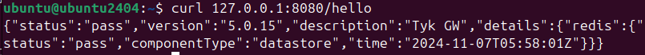

# Installation de Tyk-Gateway sur le port 8080

**Commande pour lancer Tyk Gateway avec docker:**

```bash
docker run -it -d --name  tyk-gateway -p 8080:8080 evrad7/ms2d5-tyk
```

**Vérification du succès de l’installation :**

```bash
  curl localhost:8080/hello
```

Le résultat devrait être similaire à cette image


## Ajout une url pour la recherche

-> Définir l'URL dans le fichier JSON
On crée une nouvelle route (par exemple /search) qui accepte une requete avec un parametre de requête (query parameter) nomme query.

-> Configurer une réponse statique
Utilisons la fonctionnalite mock_response de Tyk pour répondre avec une reponse arbitraire en JSON.

-> Documenter la route dans OpenAPI
Ajoute la documentation pour la nouvelle route, y compris les paramètres et la structure de la réponse.
